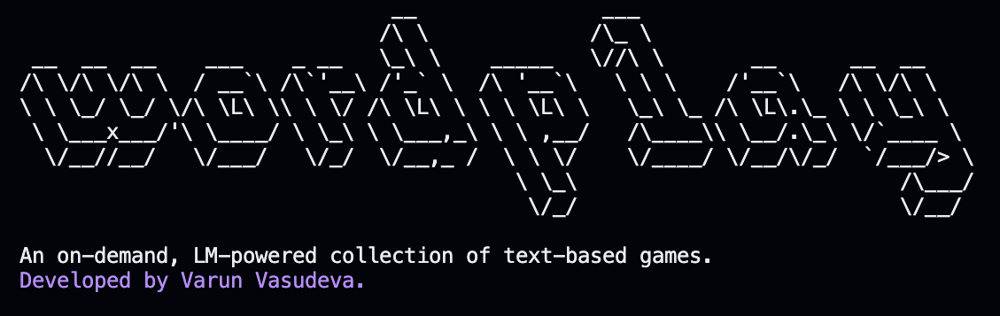

# Wordplay: On-Demand Text Games



An open-source CLI for fun text-based games powered by large language models (LLMs).

### [VIEW AVAILABLE GAMES](/docs/games.md)

## Features

- **Dynamic:** Questions and scenarios are generated by the models on your machine.
- **Customizable:** Where it applies, tailor games to your liking: trivia on what you like being quizzed on, the difficulty level you want to play a game at, etc.
- **Local & Private**: Runs on your machine, with the LLM endpoint of your choosing. Plug in a SoTA model via an 'Open'AI-compatible API or use your local models with Ollama.

## Getting Started

Run the following in a terminal window:
```bash
git clone https://github.com/varunvasudeva1/wordplay-cli
cd wordplay-cli
./setup.sh
```

The `setup.sh` script will install the required packages from `npm`, build the project, and install the project as a package globally. You will be prompted for your password at the end - this is because downloading a package globally requires `sudo` access.

You can confirm your installation by running `wordplay`.

> [!NOTE]
> To update, run `git pull` to pull the latest changes and rerun `setup.sh`.
>
> To uninstall, run `sudo npm uninstall -g wordplay` and delete the `wordplay-cli` directory.

## Usage

1. Configure environment
   ```bash
   wordplay config -b (base_url) -p (provider) -m (model)
   ```
   - `base_url`: Base URL of the API endpoint, e.g. `localhost:11434` for a default Ollama installation or `https://api.openai.com/v1` for the 'Open'AI API.
   - `provider`: Choice between `ollama` and `openai`.
   - `model`: Your model of choice, e.g. `gemma2:27b` or `gpt-whatever`.

2. Check available games
   ```bash
   wordplay list
   ```

3. Play!
   ```bash
   wordplay play (game)
   ```

4. View scores
   ```bash
   wordplay score (game)
   ```

> [!IMPORTANT]
> Using more capable models will make for a better experience - use the best one you can within your means, either via cloud API or locally.

## Acknowledgements

I got the idea for this CLI after watching Rick & Morty's funny depiction of a Terminal-style, text-based adventure game (where you're in a forest and die no matter what you do).

- [Text to ASCII Generator](http://www.patorjk.com/software/taag/#p=display&f=Graffiti&t=Type%20Something%20) courtesy of [patorjk.com](www.patorjk.com).
- [english-words](https://github.com/dwyl/english-words) master word list courtesy of [dwyl](https://github.com/dwyl) and contributors.
- [Guide to building a TypeScript CLI](https://blog.logrocket.com/building-typescript-cli-node-js-commander/#making-cli-globally-accessible) by [Stanley Ulili](https://blog.logrocket.com/author/stanleyulili/).
